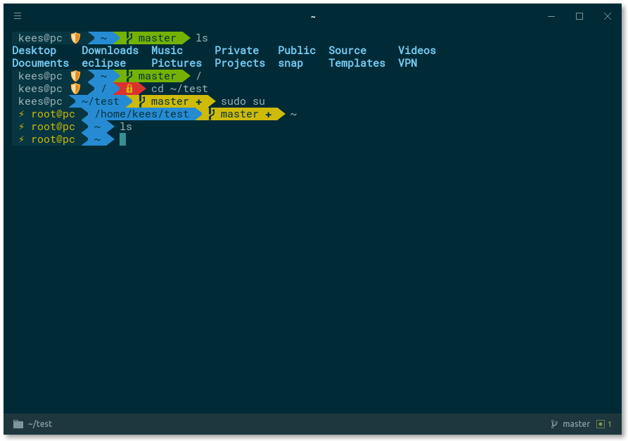

# Zen ZSH Theme

💻 A zen theme for Oh My ZSH, using Powerline fonts.

> This project is a fork of [agnoster-zsh-theme](https://github.com/agnoster/agnoster-zsh-theme). You can learn about further customization on the [original project](https://github.com/agnoster/agnoster-zsh-theme).

> The above Terminal emulator used is called [Hyper](https://hyper.is). The theme is called [hyper-dark](https://github.com/keesvv/hyper-dark), which is one of my forks.

# Compatibility

> This theme **ONLY** functions correctly if you have a [Powerline-patched font](https://github.com/Lokaltog/powerline-fonts) installed on your system.

To test if your terminal and font support it, check that all the necessary characters are supported by copying the following command to your terminal: `echo "\ue0b0 \u00b1 \ue0a0 \u27a6 \u2718 \u26a1 \u2699"`. The result should look like this:

# Features

**Zen ZSH displays the following in your prompt:**

- If the previous command failed (✘)
- user@hostname
- Git status
  - Branch () or detached head (➦)
  - Current branch / SHA1 in detached head state
  - Dirty working directory (±, color change)
- Working directory
- Elevated (root) privileges (⚡)
- If the current directory is writable. If not, this icon (🔒) will be displayed.
- Current VPN status
