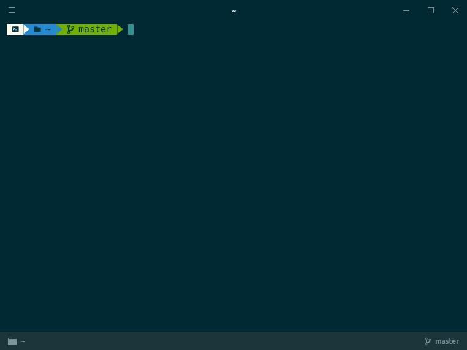
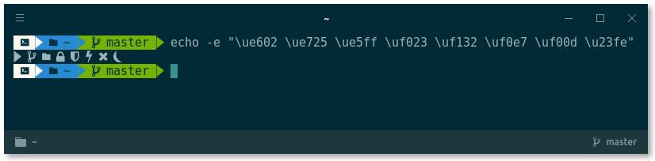

# Zen ZSH Theme

💻 A zen theme for Oh My ZSH, using NerdFonts.

> This project is a fork of [agnoster-zsh-theme](https://github.com/agnoster/agnoster-zsh-theme). You can learn about further customization on the [original project](https://github.com/agnoster/agnoster-zsh-theme).

> The above Terminal emulator used is called [Hyper](https://hyper.is). The theme is called [hyper-dark](https://github.com/keesvv/hyper-dark), which is one of my forks.

# Compatibility

> This theme **ONLY** functions correctly if you have a [NerdFonts-patched font](https://nerdfonts.com/#downloads) installed on your system.

If you have a NerdFonts-patched font installed on your system, make sure you **also have the font selected as default in your terminal**.

To test if your terminal and font support it, check that all the necessary characters are supported by copying the following command to your terminal: `echo -e "\ue602 \ue725 \ue5ff \uf023 \uf132 \uf0e7 \uf00d \u23fe"`. The result should look like this:

# Features

**Zen ZSH displays the following in your prompt:**

- If the previous command failed (  )
- If there is a suspended process running in the terminal ( ⏾ )
- A nice little terminal icon
- Git status
  - Branch (  ) or detached head ( ➦ )
  - Current branch / SHA1 in detached head state
  - Dirty working directory (±, color change)
- Working directory
- Elevated (root) privileges (  )
- If the current directory is writable. If not, this icon (  ) will be displayed
- Current VPN status (  )
